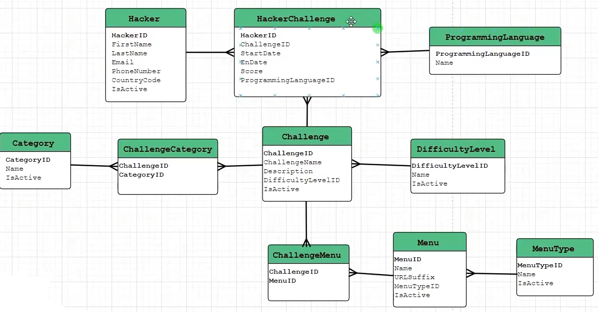
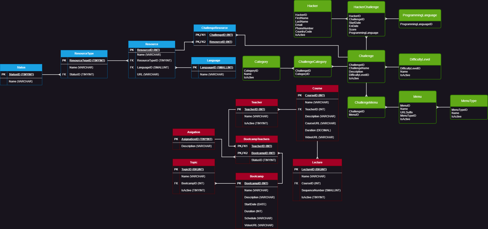

# Caso a resolver

Diseñar y normalizar la base de datos para el siguiente caso:

CodigoFacilito y HackerRank decidieron hacer una alianza por lo que ahora en la página de HackerRank.com será posible ver en cada reto uno o varios links a cursos, clases o bootcamps donde se abarquen los conceptos para resolver el reto. Por ejemplo: Un reto de SQL donde se pide hacer sumas y agrupaciones, podría tener links a un curso de SQL, a las clases especificas donde se abarcan funciones de agregación, selects y agrupaciones o al BootCamp de Backend con Python.

HackerRank ya tiene la base de datos de su sistema actual, únicamente es necesario crear nuevas entidades y relaciones para crear la nueva funcionalidad.

Diagrama entidad relacion de la base de datos ya creada:

## Problema

1. Se quiere agregar una nueva pestaña, en donde se enlistaran cursos:

2. Dentro de ese pestaña se quiere tener las siguiente funcionalidades:

## Resolucion

Crear el diagrama entidad relacion que de solucion al problema planteado:

