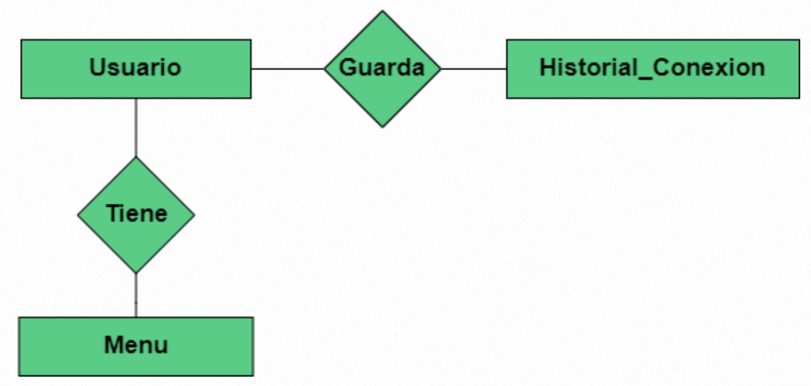
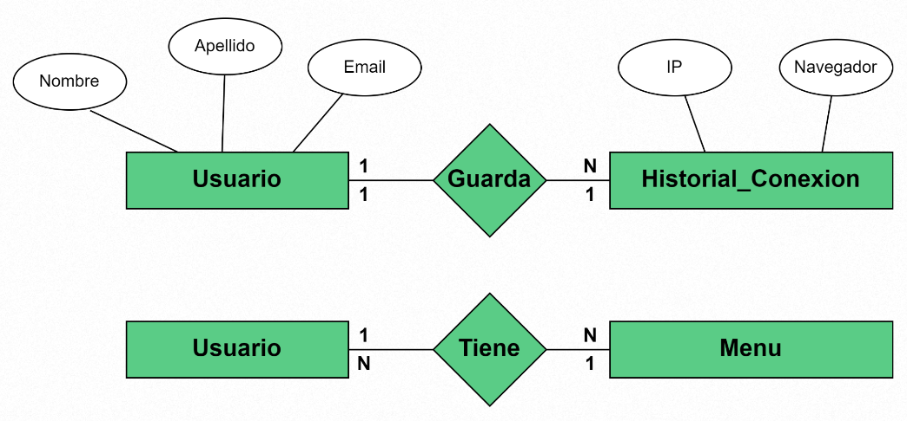
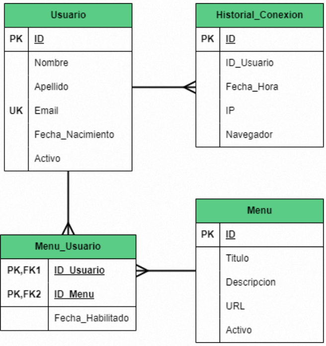
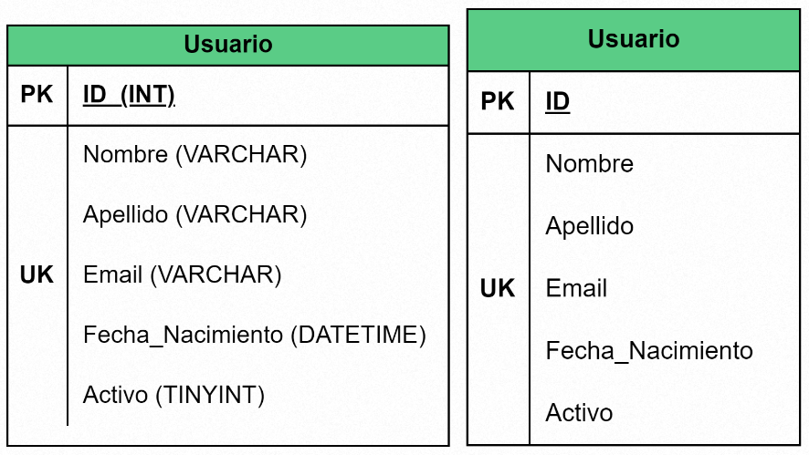
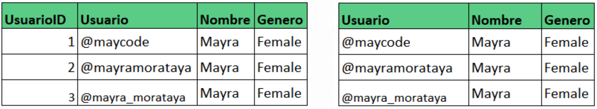
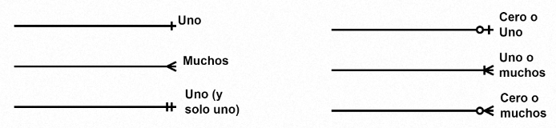
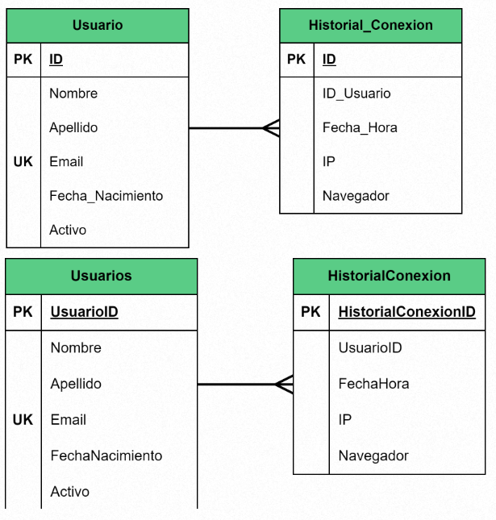

# Tipos de Diagrama Entidad Relación

## Diagrama ER - Modelo Conceptual

- Incluye las entidades importantes y las relaciones entre ellas.
- No se especifica ningún atributo.
- No se especifica ninguna clave principal.

## Diagrama ER - Modelo Lógico

- Incluye todas las entidades y relaciones entre ellos.
- Todos los atributos para cada entidad están especificados.
- La clave principal para cada entidad está especificada.
- Se especifican las claves externas (claves que identifican la relación entre diferentes entidades).
- La normalización ocurre en este nivel.

## Diagrama ER - Modelo Físico

- Especificación de todas las tablas y columnas.
- Las claves externas se usan para identificar relaciones entre tablas.
- La desnormalización puede ocurrir según los requisitos del usuario.

> Este tipo de Diagrama ER es el que se utiliza comúnmente en las empresas.

## Entidad o Tabla

### Propiedades:

- Nombre de la tabla, debe ser único
- Campos o atributos
- Cada campo tiene un tipo de dato asociado. (El tipo de dato no siempre se especifica)
- La tabla puede tener una llave primaria. (PK)
- Si ningún campo de la tabla es único, se puede usar un correlativo. (Lo recomendable es que todas las tablas tengan llave primaria)
- Una tabla puede tener una o varias llaves foráneas si hubieran relaciones de uno a muchos. (FK)
- Los campos pueden tener otros contraints como Unique Key (UK), Not Null, etc.

## Llaves Primarias

- Puede estar conformada por uno o varios campos.
- Ayudan a cuidar que no haya duplicados.
- Lo más común es que las llaves primarias sean correlativos (automáticos o manuales) pero cualquier campo podría ser llave primaria siempre y cuando sea único null.

## Llaves Foráneas

- Puede estar conformada por uno o varios campos.
- Es utilizada para conectar los datos de una tabla con otra(s).
- La llave primaria de una tabla pasa a ser llave foránea de otra tabla.
- El campo (o los campos) que son llave primaria en una tabla pueden tener el mismo nombre o no, en la tabla en la que son llave foránea.
- El campo (o los campos) que son llave primaria en una tabla y pasan a ser llave foránea a otra deben de tener el mismo tipo de dato.

