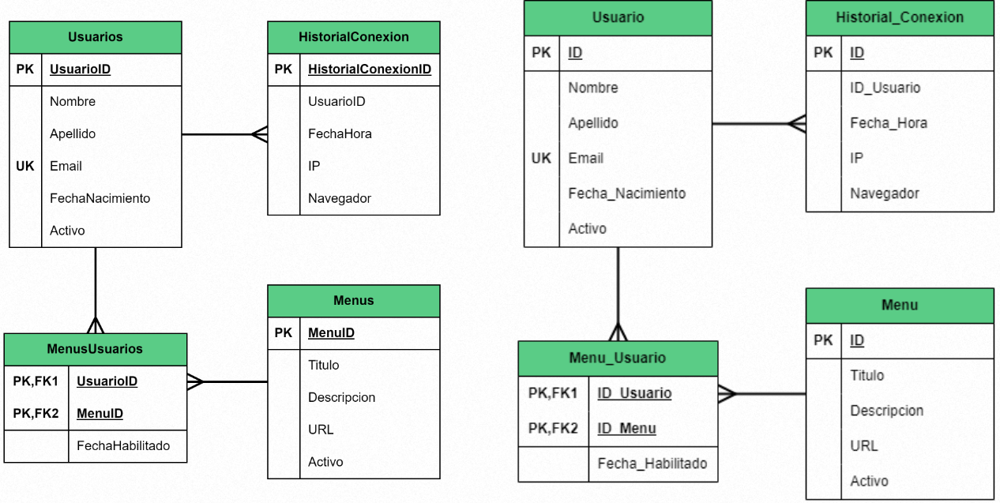
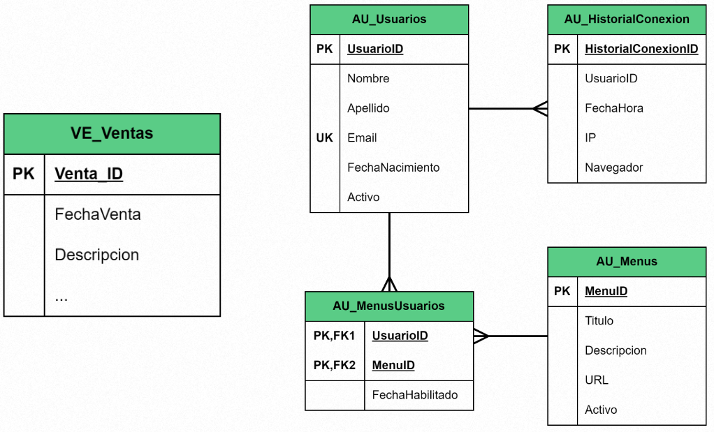
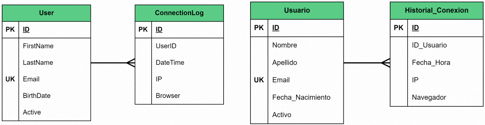
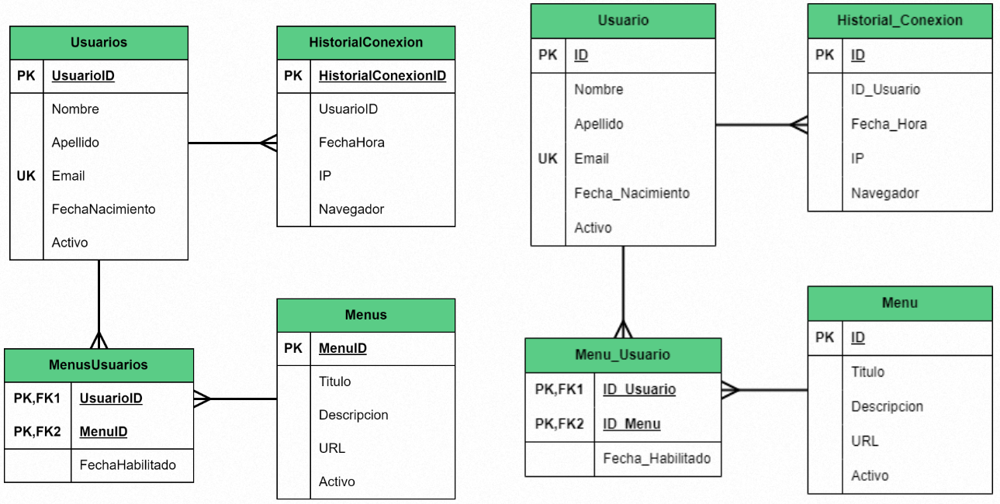

# Tips al diagramar

Observar el diagrama ER actual de la BD de la empresa, y lo nuevo que se diagrame que siga el mismo patrón.

Observar la nomenclatura de nombres de objetos (tablas, campos, triggers, funciones, etc) y replicarla a los nuevos objetos. 

Observar si la empresa utiliza mnemónicos, o si es una BD completamente nueva, decidir desde el inicio si será conveniente o no usar mnemónicos.

Utilizar nombres de objetos en el mismo idioma (todo español o todo inglés).

Utilizar todos los nombres de tablas en plural o todos en singular. 

No hay una regla estricta, la práctica más común y recomendada es utilizar nombres de tablas en singular.

Otros Ejemplos:

- Para nombres compuestos por varias palabras definir si se usará algún caracter como _ para separarlas o no.
- Para los nombres muy largos de tablas y/o campos se usarán abreviaturas o no.
- Algunos gestores de BD permiten definir nombres de objetos con caracteres especiales, definir si se usarán o no.
- Para campos con 2 posibles valores como True / False, 1 / 0, S / N, Y / N, definir con qué tipo de dato se almacenarán para aplicar la misma regla a todas las tablas.
- Para tablas y campos que guardan status (En Proceso, Exitoso, Fallido, etc) definir si sus llaves primarias serán letras P = En proceso, E = Éxito, F = Fallido o correlativos.

Es muy importante que la base de datos sea homogénea, es decir que todos los nombres de objetos (tablas, campos, funciones, etc) tengan una misma nomenclatura para facilitar el mantenimiento y hacer queries.