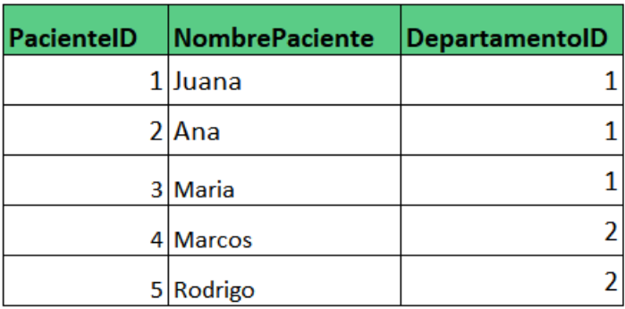
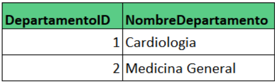
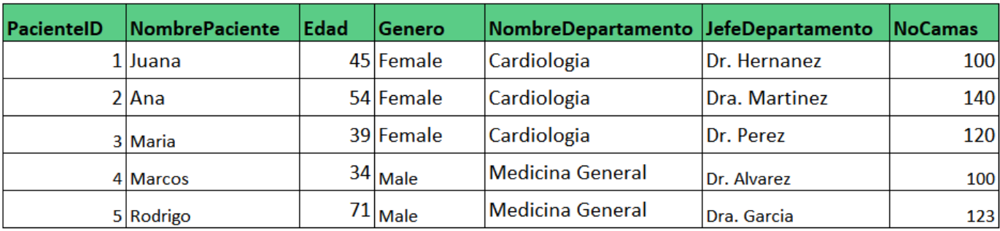
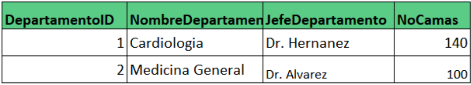
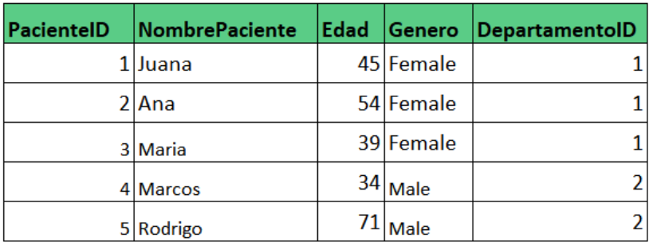

# Tercera Forma Normal (3NF)

1. Cumple todas las reglas de la 2NF.

2. Todas las columnas en las tablas dependen completamente de llaves primarias.

Todos los datos del departamento dependen del PacienteID. ❌

- Si una base de datos cumple todas las reglas anteriores se considera que está en la tercera forma normal.

## Forma normal de Boyce-Codd (BCNF)

También conocida como Forma Normal 3.5

Es considera una versión más estricta de la 3NF.

Los registros de la tabla deben ser considerados únicos, se considera único basado en la combinación de las columnas.