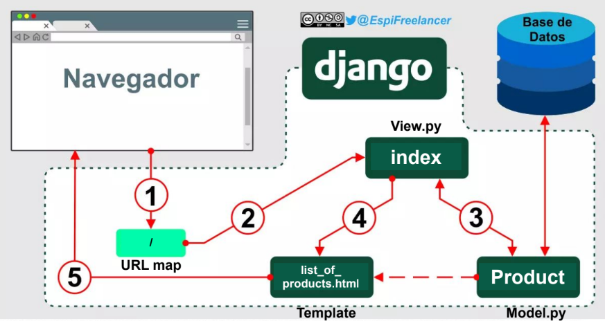
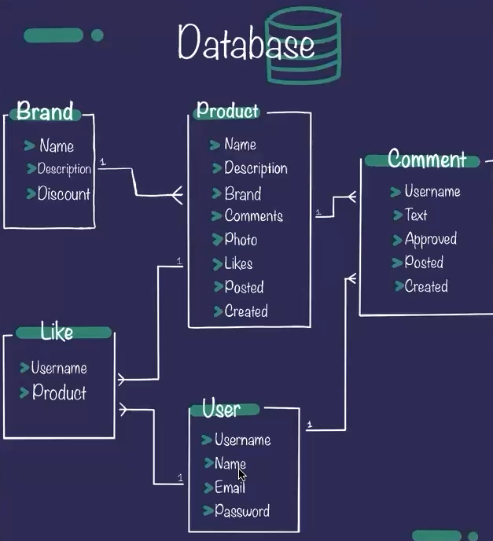

# Pasos seguidos

## 0. Model Template Vista (MTV) actual:



## 1. Configurar DB con MySQL

1. Por defecto, django viene con la base de datos SQLite, si queremos cambiar la base de datos a otra debemos ir a la pagina [settings](https://docs.djangoproject.com/en/5.1/ref/settings/#databases), y en ella buscar que motor debemos modificar, teniendo en cuenta que dase de datos usaremos, para este proyecto la cambiaremos a MySQL, asi que ya teniendo instalado y configurado MySLQ, crearemos la base de datos que usaremos dentro de MySQL, esto con el comando:

```mysql
CREATE DATABASE my_tienda
```
2. Una vez creada la DB, en el archivo `settings.py` que está en la ruta `Proyecto/my_tienda/settings.py`, modificaremos el bloque `DATABASES`:

- `DATABASES` actual (por defecto sqlite):
```python
DATABASES = {
    'default': {
        'ENGINE': 'django.db.backends.sqlite3',
        'NAME': BASE_DIR / 'db.sqlite3',
    }
}
```

- `DATABASES` para MySQL:
- Prodriamos tener las configuraciones puestas en el mismo archivo, pero esto no estaria bien aplicado en el tema de seguridad, asi que para tener un poco mas de seguridad, los datos de las configuraciones las guardaremos en un archivo `.env` y este archivo se agregara a `.gitignore` para que no se guarde en el repositorio.
- Asi que debemos crear un archivo `.env` al mismo nivel que el archivo `manage.py` en el que guardaremos las configuraciones de la db, este contendra la estructura (modificandolo a los respectivos valores):

```text
DB_NAME=NAME
DB_USER=USER
DB_PASSWORD=PASSWORD
DB_HOST=HOST
DB_PORT=PORT
```

- Una vez hecho esto, en `settings.py` modificaremos el apartado de `DATABASES`, al igual que importaremos `os` y `dotenv` para leer el archivo `.env` y tener los datos al momento de ejecutar el proyecto. 

```python
# Añadir al inicio
import os
from pathlib import Path
from dotenv import load_dotenv

load_dotenv() # Cargar variables de entorno

# Build paths inside the project like this: BASE_DIR / 'subdir'.
BASE_DIR = Path(__file__).resolve().parent.parent

# Modificar DATABASES
DATABASES = {
    'default': {
        'ENGINE': 'django.db.backends.mysql',
        'NAME': os.environ.get('DB_NAME'),
        'USER': os.environ.get('DB_USER'),
        'PASSWORD': os.environ.get('DB_PASSWORD'),
        'HOST': os.environ.get('DB_HOST'),
        'PORT': os.environ.get('DB_PORT'),
    }
}
```

3. Instalar mysqlclient en el proyecto:

```commandline
pip install mysqlclient
```

4. Instalar dotenv en el proyecto:

```commandline
pip install python-dotenv
```

## 2. Migraciones

Si corremos el programa, debera iniciar sin problemas, solo nos aparecerá el mensaje:

```text
You have 19 unapplied migration(s). Your project may not work properly until you apply the migrations for app(s): admin, auth, contenttypes, products, sessions.
```

Esto nos aparece porque acabamos de cambiar la base de datos.

1. Para realizar las migraciones haremos:

```commandline
python manage.py migrate
```

2. Con esto pasaremos todas las tablas que estan en sqlite a mysql. Al hacer esto, unicamente estaremos migrando las tablas, pero la informacion dentro no. Asi que debemos volver a crear un superuser:

```commandline
python manage.py createsuperuser
```

## 3. Settings

1. Ahora para tener una configuracion basada en entornos/ambientes (Dev, QA, Prod.), crearemos una carpeta [settings](Proyecto/settings).
2. En ella crearemos varios archivos python basándonos en la cantidad de ambientes de trabajo que usemos. Para este proyecto se crearán 3 ambientes de trabajo.
3. Primero crearemos el archivo [base.py](Proyecto/settings/base.py) en el que estaran todas las cofiguraciones generales, para ello copiaremos lo que contiene `settings.py` que está en la ruta `Proyecto/my_tienda/settings.py` y lo pegaremos en `base.py`.
4. Ahora, iremos modificando y creando distintos archivos con base en que configuraciones queramos que tenga cada ambiente, en este caso quitaremos de `base.py` las siguientes configuraciones para moverlas a [local.py](Proyecto/settings/local.py):

```python
import os
from .base import *
from dotenv import load_dotenv

load_dotenv() # Cargar variables de entorno
# Database
# https://docs.djangoproject.com/en/5.1/ref/settings/#databases

DATABASES = {
    'default': {
        'ENGINE': 'django.db.backends.mysql',
        'NAME': os.environ.get('DB_NAME'),
        'USER': os.environ.get('DB_USER'),
        'PASSWORD': os.environ.get('DB_PASSWORD'),
        'HOST': os.environ.get('DB_HOST'),
        'PORT': os.environ.get('DB_PORT'),
    }
}
```

Estos lo moveremos al archivo `local.py` y lo borraremos de `base.py`.

5. Al igual simularemos tener un ambiente de produccion, creando el archivo [prod.py](), en el que tendremos la sig. configuracion:

```python
from .base import *

# Sobreescribimos el DEBUG de base.py
DEBUG = False

# Database
# https://docs.djangoproject.com/en/5.1/ref/settings/#databases

DATABASES = {
    'default': {
        'ENGINE': 'django.db.backends.mysql',
        'OPTIONS': {
            #
        }
    }
}
```

Para este proyecto no se simulará un ambiente de produccion, pero para las configuraciones lo tendremos en cuenta como un ambiente extra.

6. Borraremos el archivo `settings.py` que esta en la ruta `Proyecto/my_tienda/settings.py`.
7. Una vez que borramos el archivo cuando queramos iniciar el proyecto nos dara error, ya que no encuentra el archivo `settings.py`, ahora para cada que queramos iniciar el proyecto, deberemos de especificar la ruta del archivo settings especifico de cada ambiente, asi que iniciaremos el proyecto activando el ambiente local, y para esto ejecutamos el comando:

```commandline
python manage.py runserver --settings=settings.local
```

Si todo lo hicimos correctamente, nos tuvo que iniciar el proyecto sin ningun error. Y de esta manera hemos activado el ambiente local. Y si queremos iniciar el proyecto en produccion usaremos el mismo comando solo cambiando la ruta:

```commandline
python manage.py runserver --settings=settings.prod
```

## 4. Modelos

1. El siguiente diagrama es el modelo que queremos tener en nuestra DB:



2. Para lograr esto, agregaremos las respectivas tablas en el archivo [models.py](Proyecto/products/models.py), empezaremos con la tabla Brand, incluyendo sus respectivos atributos:

```python
class Brand(models.Model):
    name = models.CharField(max_length=100)
    description = models.TextField(null=True, blank=True)

    created_date = models.DateTimeField(default=timezone.now)
    published_date = models.DateTimeField(blank=True, null=True)

    def __str__(self):
        return self.name
```

3. En [admin.py](Proyecto/products/admin.py) debemos agregar esta nueva tabla para poder acceder desde la pagina de admin:

```python
from django.contrib import admin
from .models import Products, Brand

# Register your models here.
admin.site.register(Products)
admin.site.register(Brand)
```

4. Ahora para referenciar esta tabla en la tabla products, tenemos que modificar lo siguiente:

```python
# Modificamos este parametro para referenciar a la otra tabla
    brand = models.ForeignKey(
        'products.Brand',
        on_delete=models.CASCADE,
        related_name='products'
    )
```

5. Ahora debemos hacer las migraciones, estos con el comando:

```commandline
python manage.py makemigrations --settings=settings.local
```

Si salio bien nos debio dar la salida:

```text
Migrations for 'products':
    + Create model brand
    ~ Alter field brand on products
```

6. Ahora ejecutaremos las migraciones:

> Antes de hacer las migraciones, debemos tener la tabla products vacia, ya que al agregarse una llave foranea, al momento de realizar migracion nos dara error por no tener referencia al elemento. En MySQL podemos eliminar los elementos usando el comando:
>
> ```mysql
> DELETE FROM my_tienda.products_products WHERE ID = 1;
> ```

Una vez eliminado los elementos, ejecutamos el comando:

```commandline
python manage.py migrate --settings=settings.local
```

Si salio bien nos debio dar la salida:

```text
Operations to perform:
  Apply all migrations: admin, auth, contenttypes, products, sessions
Running migrations:
  Applying products.0002_brand_alter_products_brand... OK
```

## 5. Vista

1. Agregaremos unan nueva vista que nos lleve a ver mas detalles de algun producto.
2. Para ello debemos crear una vista, una nueva url y mapearla, asociar la vista con el modelo y crear el template a devolver.
3. Primero crearemos la vista, en el archivo [view.py](Proyecto/products/views.py) añadiremos lo siguiente:

```python
def get_product(request, id):
    product = Products.objects.get(id=id)
    return render(
        request,
        'show_product.html',
        {'product': product})
```

4. En [url.py](Proyecto/products/urls.py) agregaremos la ruta a esa vista:

```python
# Importar las vistas creadas
from .views import index, get_product

urlpatterns = [
    path('', index),
    path('/product/<int:id>', get_product, name='get_product')
]
```

5. Ahora en la carpeta [templates](Proyecto/templates), agregaremos el archivo html para la vista:

```html

<html lang="es">
    <head>
        <title>Tienda de Barrio</title>
        <meta name="description" content="Mi primera tienda de barrio virtual">
        <meta name="keywords" content="ecomerce,market">
        {# Bootstrap - https://getbootstrap.com/#}
        <link href="https://cdn.jsdelivr.net/npm/bootstrap@5.2.3/dist/css/bootstrap.min.css"
              rel="stylesheet">
        <script src="https://cdn.jsdelivr.net/npm/bootstrap@5.2.3/dist/js/bootstrap.bundle.min.js"></script>
        {# Fonts #}
        <link href="https://fonts.googleapis.com/css?family=Montserrat:wght@400;700&display=swap" rel="stylesheet">
        {# Styles #}
        <link rel="stylesheet" href="">
    </head>
    <body>
        <div class="container">
            <div class="row">
                
                <div class="col-3">
                    <div class="card">
                        
                        <div class="card-body">
                            <h5 class="card-title">{{product.name}}</h5>
                            <div class="price-container">
                                <p class="card-title product-price">{{product.price}} USD</p>
                            </div>
                            <p class="card-text">
                                {{product.description}}
                            </p>
                            <a class="btn btn-tomato" href="">Leer más</a>
                        </div>
                    </div>
                </div>
                
            </div>
        </div>
    </body>
</html>
```

6. Por ultimo, en el archivo [list_of_products.html](Proyecto/templates/list_of_products.html), lo modificaremos para agregar en enrutamiento a la nueva vista, en al parte del boton, lo modificamos:

```html
<a class="btn btn-tomato" href="">Leer más</a>
```